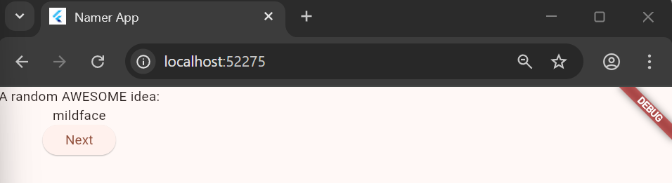
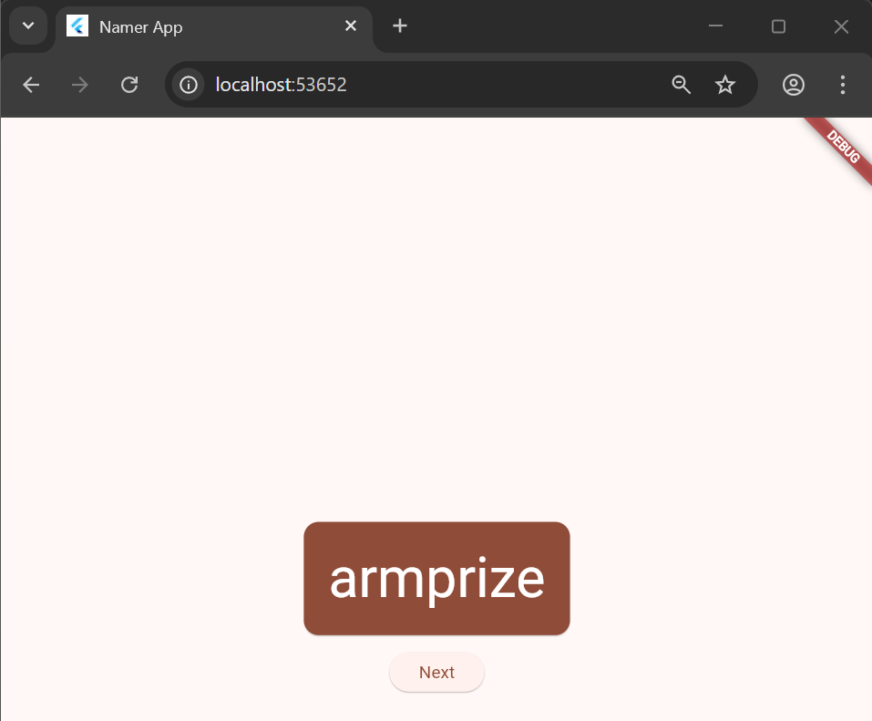
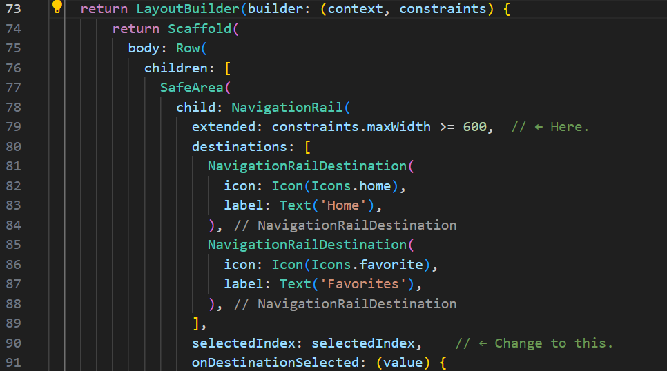

Nama: Meisy Nadia Nababan
 NIM: 2341760031
 Kelas: SIB 3F
 Mata Kuliah: Pemrograman Mobile

TUGAS
3. Membuat project
Membuat proyek Flutter pertama Anda
 1. Ketik "flutter new". Pilih perintah Flutter: New Project.

  2. Berikutnya, pilih Application lalu folder tempat proyek akan dibuat. Folder ini dapat berupa direktori utama Anda, atau direktori seperti C:\flutter project

  3. Pada panel sebelah kiri VS Code, pastikan bahwa Penjelajah dipilih lalu buka file pubspec.yaml.

 Ganti konten file ini dengan kode berikut:

  4. Berikutnya, buka file konfigurasi lainnya dalam proyek tersebut, analysis_options.yaml.

  Ganti konten file tersebut dengan kode berikut:

  5. Terakhir, buka file main.dart pada direktori lib/.

 Ganti konten file ini dengan kode berikut:

  Selagi lib/main.dart terbuka, temukan tombol "play" di pojok kanan atas jendela VS Code lalu klik tombol tersebut.

  6. Di bagian bawah lib/main.dart, tambahkan sesuatu pada string di objek Text pertama, dan simpan file tersebut (dengan Ctrl+S atau Cmd+S). Misalnya:

  Perhatikan bagaimana aplikasi segera berubah tetapi kata yang acak tetap sama. Situasi ini menunjukkan fitur stateful Hot Reload Flutter terkenal yang sedang bekerja. Hot reload dipicu saat Anda menyimpan perubahan untuk file sumber.

  7. Berikutnya, tambahkan tombol di bagian bawah Column, tepat di bawah instance Text kedua.

  Saat Anda menyimpan perubahan, aplikasi diperbarui kembali: Sebuah tombol muncul dan, saat Anda mengklik tombol tersebut, Konsol Debug di VS Code menampilkan pesan button pressed!.

  8. Scroll ke MyAppState lalu tambahkan metode getNext.

Metode getNext() baru menetapkan ulang current dengan WordPair acak baru. Metode ini juga memanggil notifyListeners()(metode ChangeNotifier) yang memastikan bahwa semua orang yang melihat MyAppState diberi tahu.
  9. Tindakan terakhir adalah memanggil metode getNext dari callback tombol tersebut.

Aplikasi akan menghasilkan pasangan kata acak baru setiap kali Anda menekan tombol Next.

Mengekstrak widget
  Baris yang bertanggung jawab untuk menampilkan pasangan kata saat ini kini tampak seperti berikut: Text(appState.current.asLowerCase). Untuk mengubahnya menjadi sesuatu yang lebih kompleks, disarankan untuk mengekstrak baris ini ke widget terpisah. Memiliki beberapa widget untuk beberapa bagian logis dari UI Anda adalah cara penting dalam mengelola kompleksitas pada Flutter.
  Flutter menyediakan pembantu pemfaktoran ulang untuk mengekstrak widget, tetapi sebelum Anda menggunakannya, pastikan bahwa baris yang akan diekstrak hanya mengakses yang diperlukan. Sekarang baris tersebut mengakses appState, tetapi sebenarnya baris tersebut hanya perlu mengetahui apa pasangan kata saat ini.
  10. Oleh karena itu, tulis ulang widget MyHomePage sebagai berikut:

  Pada menu Refactor, pilih Extract Widget. Tetapkan nama, seperti BigCard, lalu klik Enter.
  11. Tindakan ini secara otomatis membuat class baru, BigCard, di akhir file saat ini. Class tersebut akan terlihat seperti berikut:

  Sekarang saatnya membuat widget baru ini menjadi UI tebal yang kita bayangkan di awal bagian ini.
Temukan class BigCard dan metode build() yang berada di dalamnya. Sama seperti sebelumnya, panggil menu Refactor pada widget Text. Namun, kali ini Anda tidak akan mengekstrak widget.
  Sebagai gantinya, pilih Wrap with Padding. Tindakan ini menciptakan widget induk baru di sekitar widget Text bernama Padding. Setelah menyimpannya, Anda akan melihat bahwa kata acak tersebut telah memiliki ruang yang lebih luas.

  12, Tingkatkan padding dari nilai default 8.0. Misalnya, gunakan 20 untuk padding yang lebih luas. Berikutnya, mari kita naik satu tingkat lebih tinggi. Tempatkan kursor Anda pada widget Padding, buka menu Refactor, lalu pilih Wrap with widget....
  Tindakan ini memungkinkan Anda untuk menentukan widget induk. Ketik "Card" dan tekan Enter.

  Kode ini menggabungkan widget Padding, dan juga Text, dengan widget Card.

 Untuk membuat kartu menjadi lebih menarik, beri warna yang lebih kaya pada kartu tersebut. Karena ada baiknya untuk menjaga skema warna yang konsisten, gunakan Theme aplikasi untuk memilih warna.
  13. Buat perubahan berikut untuk metode build() BigCard.

Kini, kartu telah diwarnai dengan warna primer aplikasi:

  Anda dapat mengubah warna ini serta skema warna keseluruhan aplikasi dengan men-scroll ke atas ke MyApp dan mengubah warna seed untuk ColorScheme di sana.

  14. Kartu tersebut masih memiliki masalah: ukuran teks terlalu kecil dan warnanya membuat teks sulit dibaca. Untuk memperbaiki masalah ini, buat perubahan berikut pada metode build() BigCard. 

Kini, aplikasi akan terlihat seperti berikut:

  Setelah pasangan kata acak dihadirkan dengan gaya visual yang cukup, saatnya menempatkan UI di tengah jendela/layar aplikasi.

  15. Pertama, ingatlah bahwa BigCard adalah bagian dari Column. Secara default, kolom menggabungkan turunan kolom di bagian atas, tetapi kita dapat mengganti ini dengan mudah. Buka metode build() MyHomePage, dan buat perubahan berikut:

  Tindakan ini menempatkan turunan dalam Column di tengah pada sumbu utamanya (vertikal).

  Turunan UI telah ditempatkan di tengah pada sumbu silang kolom (dengan kata lain, turunan UI telah ditempatkan di tengah secara horizontal). Namun, Column itu sendiri tidak ditempatkan di tengah dalam Scaffold. Kita dapat memverifikasi ini menggunakan Widget Inspector.

  Kini, aplikasi akan terlihat seperti berikut:

  16. Dengan perubahan opsional, MyHomePage mencakup kode berikut:

  Aplikasinya akan terlihat seperti berikut:

  17. Menambahkan logika bisnis
Scroll ke MyAppState dan tambahkan kode berikut:

Menambahkan tombol
  Dengan terselesaikannya "logika bisnis", saatnya untuk mengerjakan antarmuka pengguna kembali. Meletakkan tombol ‘Like' di sebelah kiri tombol ‘Next' memerlukan Row. Widget Row adalah padanan horizontal dari Column, yang telah Anda lihat sebelumnya.

Pertama, gabungkan tombol yang ada pada Row. Buka metode build() MyHomePage, letakkan kursor pada ElevatedButton, buka menu Refactor dengan Ctrl+. atau Cmd+., lalu pilih Wrap with Row.

UI kembali ke tempat sebelumnya.

  18. Berikut satu cara untuk menambahkan tombol kedua untuk MyHomePage. Kali ini, gunakan konstruktor ElevatedButton.icon() untuk membuat tombol dengan ikon. Di bagian atas metode build, pilih ikon yang sesuai tergantung pada apakah pasangan kata saat ini sudah berada di favorit atau tidak. Selain itu, perhatikan penggunaan SizedBox lagi, untuk menjaga jarak antara kedua tombol.

output kode:

  19. Untuk mencapai inti dari langkah ini secepat mungkin, pisahkan MyHomePage menjadi 2 widget terpisah.
  Pilih keseluruhan MyHomePage, hapus, dan gantikan dengan kode berikut:

  Saat disimpan, Anda akan melihat sisi visual UI telah siap—tetapi tidak bekerja. Mengklik ♥︎ (hati) pada kolom samping navigasi tidak melakukan apa pun.

  20. Widget stateful baru hanya perlu melacak satu variabel: selectedIndex. Buat 3 perubahan berikut untuk _MyHomePageState:

output kode:

  21. Tempatkan kode berikut di bagian atas metode build _MyHomePageState, tepat sebelum return Scaffold:

output kode:

  22. Sekarang kode Anda dapat memutuskan untuk menampilkan label dengan membuat kueri constraints saat ini atau tidak. Buat perubahan baris tunggal berikut untuk metode build _MyHomePageState:

output kode:

  Pekerjaan yang tersisa hanya mengganti Placeholder itu dengan layar Favorites yang sebenarnya. Pembahasan itu dibahas di bagian berikutnya.
  23. Berikut ini hanyalah salah satu cara untuk menerapkan halaman favorit. Bagaimana halaman ini diterapkan (semoga) akan menginspirasi Anda untuk bermain dengan kode—meningkatkan UI dan membuat UI sesuai keinginan Anda.
  Berikut class FavoritesPage baru:

output kode:

  24. Bereksperimenlah lebih lanjut dengan aplikasi yang Anda buat selama menjalani lab ini.

jika dihapus
